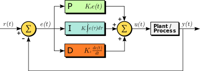

# CarND-Controls-PID
Self-Driving Car Engineer Nanodegree Program

---

## Intro
A proportional–integral–derivative controller (PID controller or three-term controller) is a control loop mechanism employing feedback that is widely used in industrial control systems and a variety of other applications requiring continuously modulated control. A PID controller continuously calculates an error value e(t) as the difference between a desired setpoint (SP) and a measured process variable (PV) and applies a correction based on proportional, integral, and derivative terms (denoted P, I, and D respectively), hence the name.[[1]](https://en.wikipedia.org/wiki/PID_controller)

  

- **Term P** is proportional to the current value of the SP − PV error e(t). For example, if the error is large and positive, the control output will be proportionately large and positive, taking into account the gain factor "K". Using proportional control alone will result in an error between the setpoint and the actual process value, because it requires an error to generate the proportional response. If there is no error, there is no corrective response.
- **Term I** accounts for past values of the SP − PV error and integrates them over time to produce the I term. For example, if there is a residual SP − PV error after the application of proportional control, the integral term seeks to eliminate the residual error by adding a control effect due to the historic cumulative value of the error. When the error is eliminated, the integral term will cease to grow. This will result in the proportional effect diminishing as the error decreases, but this is compensated for by the growing integral effect.
- **Term D** is a best estimate of the future trend of the SP − PV error, based on its current rate of change. It is sometimes called "anticipatory control", as it is effectively seeking to reduce the effect of the SP − PV error by exerting a control influence generated by the rate of error change. The more rapid the change, the greater the controlling or dampening effect.

##### Proportional (P) Control
Let's say ego car moves with a constant velocity and our reference trajectory would be the x-axis. Thus, the y-axis will represent the distance between the ego car and the reference trajectory line. Let's call this Cross-Track-Error (CTE in short).
So, how do we set the steering angle?

In proportional control, steering_angle = -t * CTE (t is a factor)

The problem with the proportional control is that the ego car overshoots!

##### Proportional-Derivative (PD) Control
To avoid overshooting problem coming with the proportional control, derivative (D) term is added. As ego car moves with the initial steering angle, the CTE would decrease for a period of time. However, the steering angle is also needed to be decreased as well.

In proportional-derivative control, steering_angle = -tp * CTE - td * (d/dt)CTE

If there is a systematic bias (e.g. a misalignment between front-wheel angles mechanically), the PD controller can not handle this.

##### Proportional-Integral-Derivative (PID) Control
To overcome the overshooting problem and the systematic bias, proportional–integral–derivative controller is used.
An example plot is provided below to compare p, pi and pid controllers.

  
_[From udacity lesson]_

### Dependencies
---

* cmake >= 3.5
 * All OSes: [click here for installation instructions](https://cmake.org/install/)
* make >= 4.1(mac, linux), 3.81(Windows)
  * Linux: make is installed by default on most Linux distros
  * Mac: [install Xcode command line tools to get make](https://developer.apple.com/xcode/features/)
  * Windows: [Click here for installation instructions](http://gnuwin32.sourceforge.net/packages/make.htm)
* gcc/g++ >= 5.4
  * Linux: gcc / g++ is installed by default on most Linux distros
  * Mac: same deal as make - [install Xcode command line tools]((https://developer.apple.com/xcode/features/)
  * Windows: recommend using [MinGW](http://www.mingw.org/)
* [uWebSockets](https://github.com/uWebSockets/uWebSockets)
  * Run either `./install-mac.sh` or `./install-ubuntu.sh`.
  * If you install from source, checkout to commit `e94b6e1`, i.e.
    ```
    git clone https://github.com/uWebSockets/uWebSockets 
    cd uWebSockets
    git checkout e94b6e1
    ```
    Some function signatures have changed in v0.14.x. See [this PR](https://github.com/udacity/CarND-MPC-Project/pull/3) for more details.
* Simulator. You can download these from the [project intro page](https://github.com/udacity/self-driving-car-sim/releases) in the classroom.

Fellow students have put together a guide to Windows set-up for the project [here](https://s3-us-west-1.amazonaws.com/udacity-selfdrivingcar/files/Kidnapped_Vehicle_Windows_Setup.pdf) if the environment you have set up for the Sensor Fusion projects does not work for this project. There's also an experimental patch for windows in this [PR](https://github.com/udacity/CarND-PID-Control-Project/pull/3).

#### Basic Build Instructions
---

1. Clone this repo.
2. Make a build directory: `mkdir build && cd build`
3. Compile: `cmake .. && make`
4. Run it: `./pid`. 


#### Project Instructions and Rubric
---
**Implementation**  
Here, heuristic approach is used so as to observe the outcome of the different parameters.  

1- **PID.cpp** file is modified to initialize PID coefficients.  
Also counters added to calculate average error.

2- In **main.cpp** file, the main function is modified so as to send PID parameters into it.
Then, steering value is calculated based on PID controller.  


**Testing**  
In this study, heuristic approach is used so as to observe the effects of the pid parameters.  

1. **P-controller** is tried with following PID parameters: 0.10-0.0-0.0  
The vehicle oscillated a lot after short time with this controller and then went off the road. 

See the full video:[[P Controller]](./vid/p.mov).  

2. **PD-controller** PID parameters: 0.10-0.0-2.0  
This prevents the oscillation. But car was stills looks like shaking.    

See the full video: [PD Controller](./vid/pd.mov).  

3. **PID-controller** PID parameters: 0.10-0.005-2.0  
 
However, higher integral values cause that steering angles began to change very rapidly, causing the vehicle to lose control.


A lower integral value is set for the pid controller.  
See the full video: [PID Controller](./videos/pid.mov).  


**Simulation**  
No tire may leave the drivable portion of the track surface. The car may not pop up onto ledges or roll over any surfaces that would otherwise be considered unsafe (if humans were in the vehicle).  

The simulation for the ideal pid controller (parameters = 0.15, 0.001, 2.5) is shown below:  

  
(6 times faster!)

See the full video: [./videos/pid_ideal.mov](./videos/pid_ideal.mov)  

---
### Future Improvements  
In this study, 2 improvements can be done as described below.  

1. The vehicle speed was increased to 60 mph, it caused crash after for while. T

Even the car didnot left the race the osicilation increase quite a lot. This problem can be overcome by adding a second controller to "throttle" as well. Because in real-life situtation driver is going to be slow in turns
See the full video: [High Speed](./vid/high.mov) 

2. Twiddle can be used for find optimum values. Heuristic approach has both slow processing and limitation in testing


